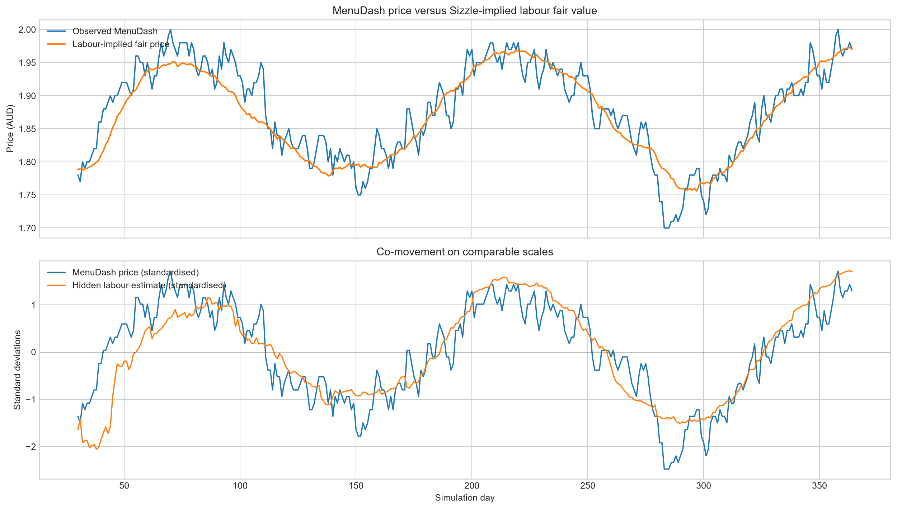

# AlgoJam 3 quantitative trading strategy

[Repository](https://github.com/jasperdewytt/algojam3) | [Event rules](docs/AlgoJam_3_Event_Info.pdf) | [Instrument specification](docs/AlgoJam3_Instrument_Specification.pdf)

This repository contains our team's entry for AlgoJam 3, an algorithmic trading competition run by UQ Fintech Society with IMC Trading. Teams received 365 days of prices for nine fictional instruments, then submitted a Python strategy for a second unseen year. Positions had to be integral, remain within instrument limits and fit inside an AUD 600,000 gross notional budget.

The data are simulated daily price series. There are no orders, quotes, spreads or executions, so this is a signal-research and portfolio-allocation project rather than a market microstructure study.

## Team work and my contribution

This was a team project. Jasper coordinated much of the research, integrated and tuned the combined submission, and made the Fintech Token, Boat Party, portfolio-budget and MenuDash changes recorded in git. Juan contributed several underlying and alternative strategies, including early Thrifted Jeans and Boat Party work. Hariharan contributed team files and participated in the team effort. Strategy choices and the submitted portfolio were team decisions.

The team reported finishing tenth overall among 38 teams and recording the highest P&L on one instrument. No leaderboard record is stored in this repository, so those competition results are not independently reproduced here.

## Competition and accounting model

On each day, `Algorithm.get_positions()` receives prices observed through that day and returns a target position for every instrument. The supplied simulator applies yesterday's held position to today's price change:

```text
daily P&L = held position x (current price - previous price)
```

The simulator does not model transaction costs or market impact. It also excludes Liferaft Ticket from local P&L because that price depended on all teams during marking. If requested gross notional exceeds AUD 600,000, the simulator sets the whole portfolio to zero for that day. The submitted algorithm therefore applies its own allocator before returning positions.

Round 1 was the visible development year. Round 2 was unseen until marking and determined the competition score, with Sharpe ratio used as a tie-breaker. The current algorithm is written for one continuously surviving instance across both years; its Boat Party calendar maps the accumulated history back to a 365-day cycle.

## Implemented strategy

The production entry is [`trader_interface/algorithm.py`](trader_interface/algorithm.py). It trades eight instruments and deliberately leaves Liferaft Ticket flat.

| Instrument | Limit | Implemented signal |
|---|---:|---|
| UQ Dollar | 650 | Mean reversion to the stated AUD 100 peg. The strategy buys below the peg and shorts above it. |
| Fintech Token | 100 | One-day reversal during startup, followed by a vote across three causal EWMA volatility classifiers. Calm regimes use reversal; high-volatility regimes use momentum. |
| Thrifted Jeans | 800 | A local-linear Kalman filter estimates price level and slope. The strategy keeps the positive-drift prior unless the estimated slope is sufficiently negative relative to its uncertainty. |
| Bread | 500 | Trend direction from a majority vote of three causal exponential moving averages. |
| Sausage | 5,000 | The same three-EMA trend vote used for Bread. |
| Sausage Sizzle | 3,000 | A one-day-ahead change forecast from current Bread and Sausage changes. It starts with Round 1 coefficients, then refits a 15-observation rolling least-squares model. |
| MenuDash | 75,000 | A latent labour-cost signal recovered from Sausage Sizzle after removing Bread and Sausage loadings. Three regression windows map that signal to a MenuDash fair value and vote on direction. |
| Boat Party Ticket | 1,000 | A frozen semester-calendar direction derived from smoothed Round 1 prices, an AUD 45 summer anchor and a live EWMA reversion rule on neutral calendar days. |
| Liferaft Ticket | 1 | Flat. Its price was generated from all teams' live positions, so no valid local backtest existed before submission. |

Signals generally request either the positive or negative position limit. The budget allocator reduces positions toward zero in a fixed priority order when their combined marked value would exceed AUD 600,000. It trims Bread first, followed by Sausage, Sausage Sizzle, MenuDash, UQ Dollar, Thrifted Jeans, Fintech Token and Boat Party Ticket. This preserves integer positions and keeps the returned portfolio inside the hard cap.

### Example of cross-instrument research

The MenuDash model follows the instrument description: labour is shared with Sausage Sizzle, while Bread and Sausage are separately observed inputs. The figure below compares observed MenuDash prices with the labour component inferred from Sizzle during Round 1.



The live calculations use observations available through day `t` to select the position earning the next price change. Boat Party is the exception in the Round 1 replay: its fixed calendar was constructed offline from the complete Round 1 series using centred smoothing. The template was frozen before Round 2, so its Round 2 use did not inspect future Round 2 prices.

## Reproducible Round 1 result

Running the current algorithm on the tracked Round 1 dataset mechanically reproduces total P&L of **AUD 720,793.99** with no budget or position-limit violations. This is an in-sample development result. It is not a strictly walk-forward backtest because the fixed Boat Party calendar uses the complete Round 1 series, and it is not evidence of expected live performance.

| Instrument | Round 1 P&L (AUD) |
|---|---:|
| Fintech Token | 157,409.00 |
| MenuDash | 140,250.00 |
| Boat Party Ticket | 125,940.00 |
| Thrifted Jeans | 119,584.00 |
| Sausage Sizzle | 80,340.00 |
| UQ Dollar | 64,551.50 |
| Bread | 22,419.49 |
| Sausage | 10,300.00 |
| Liferaft Ticket | 0.00 |

The Round 2 data used for local post-competition analysis are not part of the tracked repository. This README therefore does not present a public-checkout Round 2 reproduction.

## Repository structure

```text
trader_interface/
  algorithm.py              submitted portfolio logic
  simulation.py             supplied daily backtest engine
  data/                     tracked Round 1 prices
research/
  boat_party/               seasonality and EWMA studies
  fintech_token/            volatility-regime research
  thrifted_jeans/           Kalman and reversion audits
  liferaft/                 synthetic game experiments, not deployed
  research.ipynb            broader exploratory work
tests/
  test_budget_allocator.py  allocator boundary tests
docs/                       competition-provided rules and specifications
```

Some research reports refer to generated outputs that were intentionally excluded from git because of their size. Research scripts also use packages beyond the core requirements and are not presented as a single reproducible pipeline. The production strategy depends only on NumPy; the supplied simulator also uses pandas and Matplotlib.

Files such as `liferaft_strategy.py`, `thrifted_jeans.py` and the material under `research/` document experiments or alternative models. They are not imported by the production algorithm. `trader_interface/algorithm.py` is the definitive implemented portfolio.

## Setup and execution

The competition specified Python 3.14. From the repository root:

```bash
python -m venv .venv

# Activate the environment in Windows PowerShell:
.\.venv\Scripts\Activate.ps1

# Or on macOS/Linux:
# source .venv/bin/activate

python -m pip install -r requirements.txt
cd trader_interface
python simulation.py
```

The simulator prints daily and per-instrument P&L, reports budget violations, and writes `trader_interface/simulation_results/returns_plot.png`. It also opens the Matplotlib result window when a graphical backend is available.

Run the allocator checks from the repository root:

```bash
python tests/test_budget_allocator.py
```

These tests exercise the budget allocator directly. They are written with Python's standard `unittest` module and do not require pytest.

## Limitations and follow-up work

- Round 1 contains only one year, which limits validation of annual seasonality and regime changes. Walk-forward tests help with short-horizon models but cannot create an independent second calendar cycle.
- Several parameters were selected after substantial exploration of the same development data. A stronger process would reserve a final chronological holdout and compare every complex model with simple reversal, trend and constant-position baselines.
- The submitted Fintech regime rule assumed large moves would continue in volatile periods. Post-competition analysis found that reversal remained competitive there, showing the risk of a model selected from one observed year.
- The Thrifted Jeans regime switch was sensitive to how slope uncertainty was estimated. Model averaging would reduce dependence on a single classification boundary.
- Liferaft was an endogenous minority game with no pre-generated development path. The production strategy stayed flat rather than deploy a policy supported only by synthetic opponent scenarios.
- Competition P&L excludes transaction costs, latency and market impact. The resulting numbers should not be interpreted as executable-market returns.
